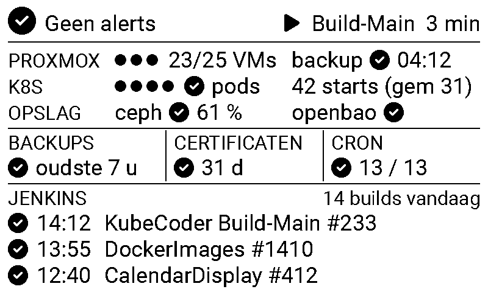
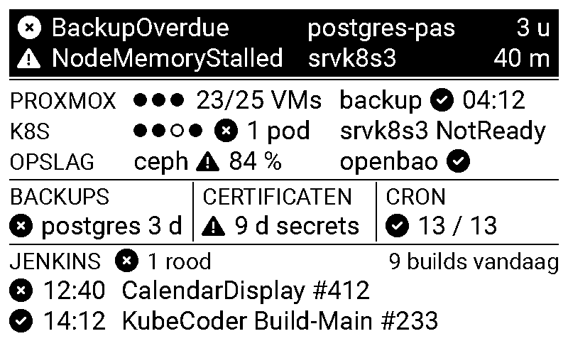

# Proposal: a second generation of the Infra Statistics Display

Date: 2026-09-22. Status: proposal, nothing implemented.

## 1. Summary

The display is an 800 x 480, black-and-white panel with a dot pitch of 0.2 mm. The current screen
packs five kinds of data onto it at font sizes down to 24 px (about 2.6 mm x-height), and the git
history shows every recent change has been "shrink the font, add a line". That road has ended.

The proposal has three parts:

1. **Change what the screen answers.** Today it shows counts and lists whether or not anything is
   wrong. The new screen answers three questions in order: *Is anything wrong right now?* *Are the
   safety nets healthy (backups, certificates, storage, secrets)?* *What is happening?* Quiet
   states collapse to a single check mark, so the normal screen has room for a 36 px body font.
   Exceptions get the space, and critical ones get an inverted (black) band you can read from
   across the room.
2. **Pull in the signals the homelab already produces but the display cannot see.** Alertmanager
   alerts, backup freshness from the backup server, certificate expiry, Proxmox cluster and vzdump
   state, OpenBao seal state, pod health and CronJob health in Kubernetes, and currently-red
   Jenkins jobs instead of "failed some time in the last two weeks". Most of these are one HTTP
   call from the backend with no new permissions.
3. **Fix the plumbing that hides problems.** A failed fetch today keeps the old screen with no
   marker. One dead upstream (Jenkins down) blanks the whole update. The panel flickers through a
   full refresh every 30 minutes even when nothing changed. All three are cheap to fix and do not
   depend on the redesign.

There is one decision the proposal cannot make for you: whether to keep rendering on the device
with LVGL (evolve the current code) or to render the screen server-side as a 48 KB bitmap and turn
the firmware into a dumb frame pusher. Section 6 lays out both. My recommendation is the
server-side bitmap, because the pain you describe is a layout-iteration problem and that moves
iteration to where it is cheap. The content and layout proposal is the same under either.

## 2. Where we are

What the screen shows today, top to bottom (`main/StatsUI.cpp`):

| Region | Content | Font | Assessment |
| --- | --- | --- | --- |
| Totals row | pods, containers, container starts per week and per day | 46 px | Vanity numbers. The start counts are a churn signal but have no reference point. |
| Node circles | per node: name, CPU %, memory %, pods, containers; overlay icons for NotReady/cordoned | 28 / 24 px | The Ready/cordoned state is the only actionable bit. CPU and memory are a single metrics-server sample every 30 minutes, which is noise. |
| Last builds | eight most recent Jenkins builds, "time: #number name" | 24 px | The feed you keep enlarging. Dominated by `AaC/*` validation runs that shadow every real build. Build status is parsed into `JenkinsBuildStatus` but never rendered, so a red build looks like a green one. |
| Failed builds and jobs | Jenkins `lastFailedBuild` per job within 14 days, plus failed Kubernetes Jobs | 24 px | `lastFailedBuild` persists after later successes, so this list shows history, not current state. A job that failed on the 10th and has passed daily since still sits here until the 24th. |

Plumbing findings that matter regardless of the redesign:

- **Staleness is invisible.** `StatsUI::update_stats()` returns silently on a download or parse
  failure. If the backend is down for a day the screen shows day-old data with nothing to say so.
- **All-or-nothing updates.** `StatsDto::from_json` fails the whole parse on any bad item, and the
  backend's `/stats` raises on any collector exception. Jenkins being slow (it is enumerated live
  on every call, about 90 jobs with two requests each) means no Kubernetes data either. The
  firmware's "fire 10 seconds early because the update takes 15 seconds" hack exists because of
  this live enumeration.
- **Every refresh flickers.** `set_full_update_every(1)` plus a render every 30 minutes means a
  5 second black-white-black cycle 48 times a day, mostly for identical content.
- **No way to refresh on demand.** The only MQTT buttons are Identify and Restart.
- The panel has 2 grey levels, a 5 s full refresh, and (on units sold after September 2023) a
  0.4 s flicker-free partial refresh. The driver already carries the partial-refresh command path
  (`waveshare_epaper.cpp`, `at_update_`) but it is forced off.

## 3. Design principle

The display is an ambient panel, not a notification channel (the Jenkins and Alertmanager Telegram
bots are) and not a metrics browser (Grafana is). Its job is to let you answer, in one glance from
a metre away, whether the homelab needs you, and roughly what it is doing.

Rules that follow from that:

- **Minimum readable size is 36 px** for anything you must be able to read; 32 px for tile titles
  and timestamps; 46 px and up for status glyphs and headline numbers. Nothing at 24 or 28 px.
  At 0.2 mm per pixel that is a 7.4 mm em and roughly a 3.9 mm x-height, comfortable at about
  1.2 m. The screen then holds about 10 text rows, and the layout budget below is built on that.
- **Exception-first.** A healthy tile is a glyph and one number. A tile only grows when it has
  something to say. The activity feed takes whatever space is left.
- **Status is computed in the backend**, one of `ok`, `warning`, `critical`, `unknown` per tile
  and per item, with thresholds that mirror the Alertmanager rules where they exist. The firmware
  renders levels; it never decides them. Changing "backup overdue" from 52 h to 30 h is a backend
  deploy, not a flash.
- **Three visual weights on a 1-bit panel**: plain (ok), outlined box with a ⚠ glyph (warning),
  inverted black band with white text (critical). Today everything has the same weight.

## 4. Proposed content

Each row is a tile. "Plumbing" is what has to change beyond the backend code itself.

| Tile | Shows | Source | Status rule | Plumbing |
| --- | --- | --- | --- | --- |
| **Alerts** (full-width band) | Count, then up to two firing alerts: name, key label (scope, node, namespace), age. "Geen alerts" when empty. A line for "N Prometheus targets down" when non-zero. | Alertmanager `GET /api/v2/alerts?active=true&silenced=false&inhibited=false` on the `prometheus-prd` Alertmanager service. | Severity label from the alert. Alertmanager unreachable is itself a `warning` line, which makes the display the dead-man's switch the alert-manager plan (§6.4) still lacks. | Service URL as env. No RBAC. |
| **Proxmox** | Three node dots (online, quorate), running / total VMs, last vzdump result and time, `local-backup` datastore usage. | Proxmox API `/api2/json/cluster/resources` and `/cluster/tasks?typefilter=vzdump`. | Node offline: critical (there is no HA, so its VMs are down). vzdump failed or older than 26 h: warning. Datastore above 85 %: warning. | A read-only `PVEAuditor` API token, stored in OpenBao and projected by ESO exactly like the Jenkins token. Egress to `pve*.home:8006`. |
| **Kubernetes** | Four node dots (filled ready, hollow NotReady, half cordoned), name only for a bad node. Unhealthy pods: count and the first name (CrashLoopBackOff, ImagePullBackOff, Pending over 5 min, not Ready outside Jobs). Container starts last 24 h against the 7-day daily average. | Core API pods and nodes (already granted), the existing container-start watch. | NotReady: critical. Any unhealthy pod: warning. Starts above 2x average: warning. | None. CPU and memory percentages are dropped from the default view and only appear as a warning line above 85 %. |
| **Opslag** (storage and secrets) | Ceph health word and used %; OpenBao sealed / unsealed and standby count. | Ceph via the mgr `prometheus` module scraped by Prometheus (`ceph_health_status`, `ceph_cluster_total_used_bytes`). OpenBao `GET https://secrets.home:8200/v1/sys/health`, unauthenticated. | HEALTH_WARN: warning, HEALTH_ERR or above 80 % used: critical. Sealed: critical. | Ceph is the one real infrastructure prerequisite: enable the mgr module on microceph and add a scrape job. Until then the tile shows "ceph —". OpenBao needs nothing. |
| **Backups** | Age of the oldest good stream and its name; any stream past `valid_until` by name. Proxmox vzdump folds in once the Proxmox tile exists. | Prometheus query over `backup_server_stream_last_backup_timestamp_seconds` and `backup_server_stream_valid_until_timestamp_seconds` (the same gauges behind `BackupOverdue`). | Past valid_until: critical. Older than 30 h: warning. | Prometheus URL as env. |
| **Certificaten** | Days to the nearest expiry and the host. | The backend opens TLS to a configured list (`secrets.home:8200`, `kubernetes-api.home:16443`, the three `pve*.home:8006`, `argocd.home`, the public hosts) and reads `notAfter`. This sidesteps the known gap that `internal_tls_cert_not_after_seconds` is scraped for the Proxmox nodes only. Extension: `ssh-keyscan` plus `ssh-keygen -L` for the SSH host certificates, the class of the July 2026 outage. | Under 14 d: warning (step-ca leaves live 47 days and renew at two thirds). Under 5 d: critical. | Host list as env. Egress to those hosts. |
| **Cron** | "13 / 13 op tijd", or the first stale job and how late. | `batch/cronjobs` list: `status.lastSuccessfulTime` against the previous scheduled time from the cron expression, skipping suspended jobs. Ten of the thirteen CronJobs have no alert today (git-sync, iot rotation, registry-cleanup, nginx renewal, version-poller and so on). | Missed the previous schedule plus a grace period: warning. Two misses: critical. | One rule added to the ClusterRole. Alternative with no RBAC: `kube_cronjob_status_last_successful_time` via Prometheus. |
| **Jenkins** (activity region) | First: builds in progress with elapsed time. Then: jobs whose *last completed* build is red. Then: the most recent builds, one line each with a status glyph, as many as fit. A "N builds vandaag" counter in the title. Folder prefixes stripped from names. | Jenkins API as now, plus `lastCompletedBuild` per job. | Any red job: warning. | An exclude list as env (`AaC/*`, `Archived/*`) so the feed shows real builds; excluded jobs still count towards red. Raise the jobs cache from 30 s to the collector interval. |
| **Footer** | Nothing when healthy. "⚠ gegevens van 09:00" when the last fetch failed or the snapshot is older than 45 minutes. | Firmware knows its last successful fetch; the backend stamps `generated_at`. | | |

Dropped from the default view: pod and container totals, per-node CPU and memory percentages,
the 14-day failed-build history. They are still in the JSON if you want them on a second page.

## 5. Proposed layout

Type scale (Roboto, generated through `tools/generate-fonts.json`): Regular 36 (body), Regular 32
(titles, timestamps), Medium 46 (headline glyphs and numbers, exists), icons 33 (exists) and 46
(new). The 24 and 28 px fonts go. New glyphs: check-circle, xmark-circle, circle, circle-half,
shield, hard-drive, lock, certificate, clock, server.

Budget at 800 x 480 with the existing 13 px margin: 454 px of height, 43 px per body row, 38 px
per title row. The activity region is the elastic one and takes what is left (three build lines
when quiet, two with a two-line alert band).

The mockups below are real 800 x 480 1-bit bitmaps rendered with the repo's own Roboto and Font
Awesome files, so the glyphs are the size the panel would show them. They come from
`proposal-mockups/render.py`, which measures every string and warns when one would cross its
column. That script is also the seed of the server-side renderer in section 6, option B.

Rendering them taught one thing the ASCII sketch hid: at 36 px, three tile columns of 258 px hold
about twelve characters, which is not enough for "23/25 VMs" next to three node dots or for
"srvk8s3 NotReady". So the platform tiles became three full-width rows (label, then two content
columns) and only the short safety-net tiles keep the three-column grid. The Kubernetes label is
"K8S" to keep the label column at 175 px.

Quiet state (`proposal-mockups/quiet.png`):

With problems (`proposal-mockups/alerting.png`). The alert band is inverted and has no title row;
the band itself is the message, and when more alerts fire than fit, the last row becomes
"+ N meer". Everything that is wrong also carries a cross or triangle glyph, so nothing depends on
reading the words:

Not shown: the stale footer, "⚠ gegevens van 09:00" in 32 px under the build lines, which only
appears when the last fetch failed.

Labels are Dutch per the `Messages.h` convention; the tile names happen to be near-identical in
both languages. Icon plus a short word beats the current icon-only style now that there is room.

A second page (the full build feed, per-node CPU and memory, the cron table, the totals) is
possible but needs an input. Options, cheapest first: an MQTT "Volgende pagina" button next to
Identify and Restart (a Home Assistant automation can then rotate pages on a schedule if you
want); a physical button on a spare GPIO reusing the CalendarDisplay `Buttons` class. I would not
rotate pages on a timer: on e-paper you will always be looking at the wrong one. Ship page one
first and see whether page two is missed.

## 6. Where to render: on-device LVGL or server-side bitmap

The content and layout above are independent of this choice. The choice decides how much firmware
work phase 2 is and how expensive every later tweak will be.

**A. Evolve the LVGL firmware.** Add the fonts, replace the bespoke grid code in `StatsUI.cpp`
(about 200 lines of grid descriptors) with a `Tile` helper (title, glyph, headline, detail lines),
extend `StatsDto` with the new sections, make the parse tolerant per section. Keep the Windows
simulator and add three JSON fixtures (quiet, alerting, degraded) so layout can be checked without
flashing. Pros: continuity with CalendarDisplay and PaperClock, the backend stays a pure data API,
the simulator investment stays useful. Cons: every wording, threshold or layout tweak is a firmware
build plus OTA plus a panel refresh, and the JSON contract has to move on both sides in step
(`CLAUDE.md`, "Backend contract").

**B. Render server-side, push a bitmap.** The backend renders the screen with Pillow (any TTF at
any size, proper text measurement, sparklines for free) to a mode-1 image and serves it as raw
packed bits: 800 x 480 / 8 = 48 000 bytes, which is byte-for-byte the format `Device::flush_cb`
already writes into the panel buffer, with matching polarity (1 = white). An ETag lets the firmware
send `If-None-Match` and skip the panel refresh on 304, so a quiet screen never flickers. The
backend also serves the same render as PNG at `/render.png` for a browser preview, and a pytest
snapshot test of that PNG replaces the Windows simulator. The firmware keeps LVGL only for the
boot and error screens and for a stale-data overlay label on top of an `lv_img` of the bitmap;
`StatsDto`, the JSON parser and the whole of `StatsUI` go away. Pros: layout iteration becomes a
Python edit with a browser preview, the contract problem disappears, the firmware becomes a
generic "bitmap panel" you can reuse for the other e-paper devices. Cons: a rendering module in
the backend (roughly the size of today's `StatsUI.cpp`), a break with the LVGL pattern of the
sibling displays, and 1-bit text needs bilevel (hinted, unantialiased) rendering, which Pillow
does with `ImageFont` in mode "1" and looks like LVGL's own 1-bpp fonts.

**Recommendation: B.** The reason this proposal exists is that the layout has been tuned by
flashing, and the tuning space is about to grow (Proxmox, Ceph, page two). Server-side rendering
turns that into the cheapest loop you have. If you prefer A, the plan below still holds; only
phase 2 changes shape.

## 7. Refresh behaviour

The 30 minute interval is a given: the panel is the cheap kind, and anything closer to real time
is a different panel, not a firmware change. Everything below keeps that cadence and only removes
refreshes that show nothing new. These apply under A or B and are independent of the redesign:

- **Skip identical frames.** Compare the packed frame with the previous one before calling
  `_display.update()`. With the footer only appearing when stale, a quiet screen is bit-identical
  between polls and never flickers. Under B the 304 gives the same for free. Nothing about the
  design depends on the age of the data being shown: every item that has a time shows it.
- **An MQTT "Ververs" button** next to Identify and Restart. Today the only way to force a refresh
  is a reboot. This is the one place a refresh happens off the 30 minute grid, and only on request.
- **Backend collects in the background** every 5 minutes and `/stats` (or the bitmap) serves the
  last snapshot instantly, with `generated_at`. The 10-second early-fire hack in
  `StatsUI::do_update()` goes, and the on-the-hour update lands on the hour.

## 8. Considered and not recommended now

- **UPS, SMART, disk health.** No signal exists anywhere in the estate (the handover doc records
  no UPS; there is no SMART exporter). Do not design a tile that waits for one.
- **Argo CD sync status tile.** Only Argo CD itself is migrated; `ArgoCDSyncFailed` and
  `ArgoCDHealthDegraded` already reach Alertmanager, so the alert band covers it. Revisit when
  more releases move.
- **Per-node CPU and memory graphs, host metrics from Prometheus.** Grafana's job. A 30 minute
  point sample on e-paper is not a trend.
- **IoT fleet online state** (nine esp-mdm devices). IoT Support holds the registry but exposes no
  fleet-status endpoint. A small endpoint, or subscribing to the MQTT availability topics, would
  make a nice second-page tile later.
- **KubeCoder environments and Claude sessions.** A "what am I working on" signal, not
  infrastructure health. Page two material if page two happens.
- **Timer-rotated pages.** See section 5.
- **Bigger panel.** You already drive IT8951 panels in CalendarDisplay and PaperClock with
  `it8951-esp32`; a 10.3" 1872 x 1404 panel is 4.9 times the area, has 16 grey levels, and the
  CalendarDisplay `Device` class is a drop-in template. Mentioned because "it's not that big" is a
  true statement, but this proposal is built to make the 7.5" panel enough, and everything in it
  scales up rather than being invalidated if you upgrade later.

## 9. Phasing

Cut to slice size; each phase is useful on its own and none depends on section 6 until phase 2.

**Phase 0, firmware quick wins (small).** Render the already-parsed build status glyph on each
build line. Add the "Ververs" MQTT button. Skip identical frames. Show the stale footer on fetch
failure. Tolerate missing top-level sections in `StatsDto::from_json` instead of failing the parse.

**Phase 1, backend (medium).** Collector framework: each collector runs on its own interval in a
background thread, returns a section or an error, and `/stats` serves the cached snapshot with
`generated_at` and an `errors` list. Fix the Jenkins semantics (last completed build, in-progress
builds, builds today, exclude list). Add collectors: Alertmanager, Prometheus (backup freshness),
Kubernetes pod health and container-start average, OpenBao health, TLS probe. Helm: env vars.
`architecture.yaml` in DockerImages gains the consumed capabilities (`cap:metrics`,
`cap:secrets-management`). The current firmware keeps working through this phase because the
existing sections keep their shape.

**Phase 2, the new screen (medium under B, large under A).** Under B: the Pillow renderer, the
bitmap endpoint with ETag, the PNG preview, a snapshot test, then a thin firmware that fetches and
blits and keeps the boot, error and stale chrome. Under A: fonts, `Tile` helper, tolerant DTO for
the new sections, simulator fixtures.

**Phase 3, tiles that need infrastructure (each small once the prerequisite exists).** Proxmox
tile after the PVEAuditor token is in OpenBao. Cron tile after the ClusterRole rule. Ceph after the
mgr prometheus module is enabled and scraped, which also gives Grafana and Alertmanager Ceph
visibility for the first time and is worth doing on its own. Optional: page two with an MQTT or
physical button.

## 10. Decisions needed from you

1. Section 6: on-device LVGL (A) or server-rendered bitmap (B).
2. Whether a Proxmox read-only API token may live in OpenBao for the backend.
3. Whether enabling the Ceph mgr prometheus module is in scope for you (it is the only tile with
   a real infrastructure prerequisite).
4. Whether a second page is wanted at all, and if so which input: MQTT button or a physical one.
5. The certificate probe host list, and whether SSH host certificates should be in it.
